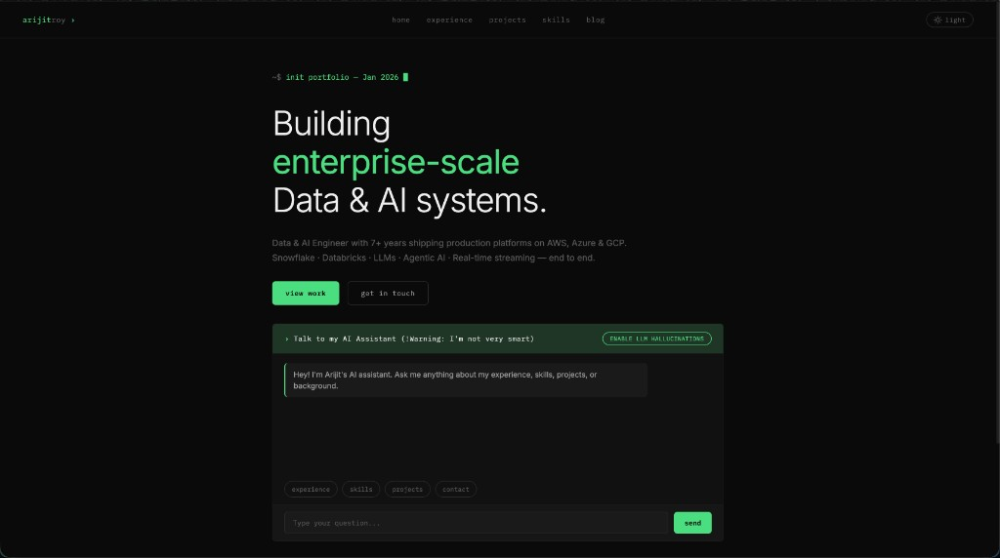

# arijitroy003.github.io

Personal portfolio — static SPA built with vanilla HTML, CSS, and JavaScript. No frameworks, no build step.

**Live:** [arijitroy003.github.io](https://arijitroy003.github.io)



## Features

- **Single Page Application** — 5 sections (Home, Experience, Projects, Skills, Blog) swapped via JS display toggling
- **AI Chatbot** — Rule-based intent detection with optional in-browser LLM mode (SmolLM2 via WebLLM/WebGPU)
- **Blog Engine** — Markdown articles rendered client-side with frontmatter parsing (vendored marked.js)
- **Dark / Light Theme** — Manual toggle with `localStorage` persistence, respects `prefers-color-scheme`
- **Skills Network Visualization** — Interactive SVG graph with category-based colors and connecting lines
- **Responsive** — Mobile-first layout, `prefers-reduced-motion` support

## Tech Stack

- **HTML5** — Semantic markup, accessibility attributes
- **CSS3** — Custom properties design system (`--bg`, `--green`, `--white`, etc.), dark/light theming via `[data-theme]`
- **Vanilla JavaScript** — SPA routing, chat UI, streaming LLM responses, blog rendering
- **Fonts** — IBM Plex Mono (UI/code), Inter (body text)
- **CI** — GitHub Actions runs `validate.py` on push, deploys to GitHub Pages

## Project Structure

```
├── index.html            # All HTML content, script loading
├── styles.css            # Design system, all styling, theme overrides
├── script.js             # SPA navigation, chat UI, theme toggle
├── knowledge-base.js     # Chatbot data, regex intents, responses
├── llm-chat.js           # WebLLM integration (optional AI mode)
├── hero-effects.js       # Skills network SVG visualization
├── blog.js               # Markdown blog engine
├── blog/                 # Blog articles (markdown + manifest.json)
├── lib/                  # Vendored libraries (marked.min.js)
├── validate.py           # CI validation (HTML/CSS/JS checks, cross-refs)
├── .nojekyll             # Prevents GitHub Pages Jekyll processing
└── .github/workflows/    # Deploy pipeline
```

## Local Development

```bash
git clone https://github.com/arijitroy003/arijitroy003.github.io.git
cd arijitroy003.github.io
python3 -m http.server 8000
# Open http://localhost:8000
```

## Validation

```bash
python3 validate.py
```

Checks HTML structure, CSS syntax, JS bracket balance, cross-references (HTML IDs ↔ JS `getElementById`, `onclick` ↔ defined functions), local asset existence, blog manifest integrity, and basic accessibility.

## Deployment

Automatic via GitHub Actions on push to `main`:

1. Runs `validate.py` — blocks deploy on failure
2. Uploads site artifact
3. Deploys to GitHub Pages

## Contact

- **Email**: arijitroy003@gmail.com
- **GitHub**: [@arijitroy003](https://github.com/arijitroy003)
- **LinkedIn**: [Arijit Roy](https://www.linkedin.com/in/sudo-kill)
- **Topmate**: [topmate.io/arijitroy003](https://topmate.io/arijitroy003)
